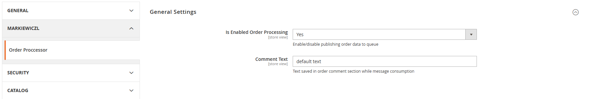
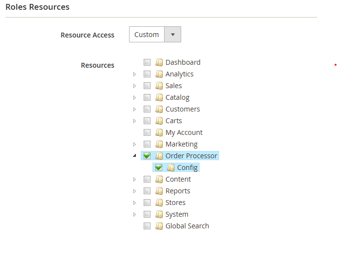
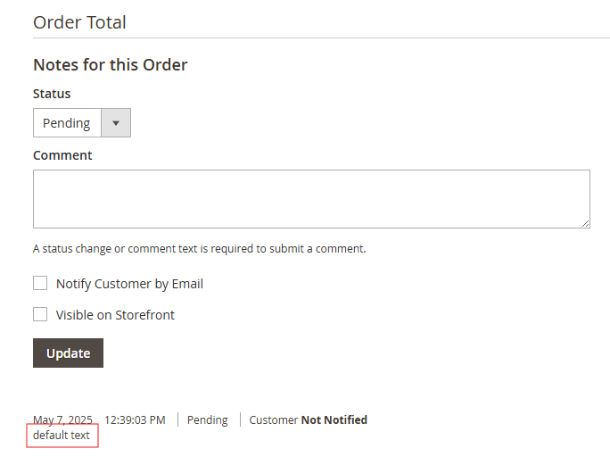
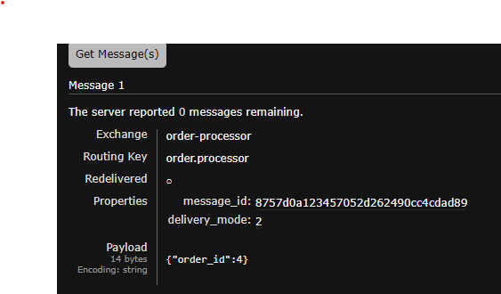
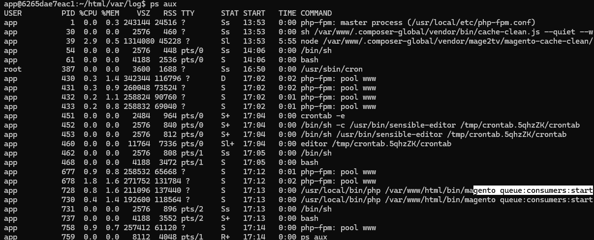

# Markiewiczl_OrderProcessor

**Asynchronously add comments to orders after placement using Magento 2 queues.**

---

## Installation

Install the module via [Packagist](https://packagist.org/packages/markiewiczl/module-order-processor) using Composer:

```bash
composer require markiewiczl/module-order-processor
```

---
## Overview

This module provides a way to add order_id to queue and add a configurable comment to the order during asynchronous processing.

### Admin Configuration

You can enable/disable the order processor and customize the comment text via the admin panel:



- **Is Enabled Order Processing** – Toggles whether the module functionality is active.
- **Comment Text** – The content of the comment added to the order when the queue message is consumed.

### ACL Permissions

The module registers custom ACL resources for access control. You can manage access to the configuration via System > Permissions > User Roles:



### Order Comment Processing
The module processes orders asynchronously through RabbitMQ, adding comments to the order status history and display
configured massage on admin order panel:  


### RabbitMQ Integration
Orders are processed through the message queue system:  

- Messages contain order IDs for processing
- Uses the `order.processor` routing key

### Queue Consumer Operation  
Process can be run manually using cron `bin/magento queue:consumer:start order.processor`

*OR*

The Process can run as a background if you add 
```'cron_consumers_runner' => [
'cron_run' => true,
'max_messages' => 10,
'consumers' => [
'order.processor',
],
'multiple_processes' => [
'order.processor' => 2
]
],
```
 to you env.php file and running `bin/magento cron install`. Then you can check is process running `ps aux`:  


## Updates possibilities

### Adding comment
By default, the order comment is added when the corresponding message is consumed from the queue.
If needed, you can modify the implementation to retrieve the configuration value before the message is published, depending on your business requirements.

### RabbitMQ validation
Support for Dead Letter Exchange (DLX) is available, but it must be configured directly within RabbitMQ to function correctly.

This allows you to capture undeliverable or failed messages for further analysis or retry mechanisms.
